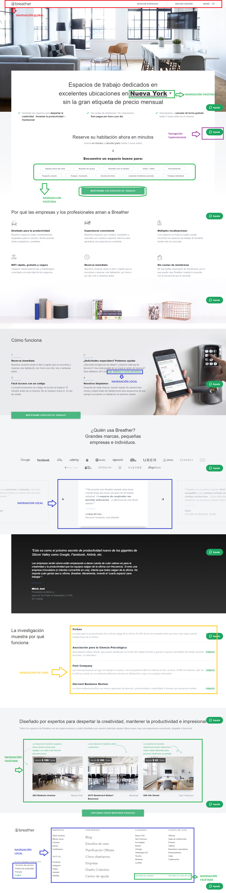
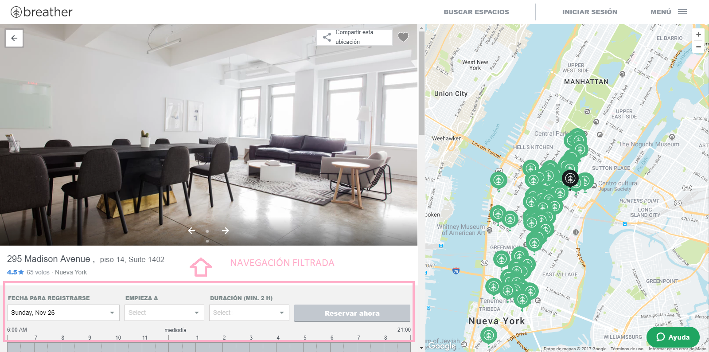
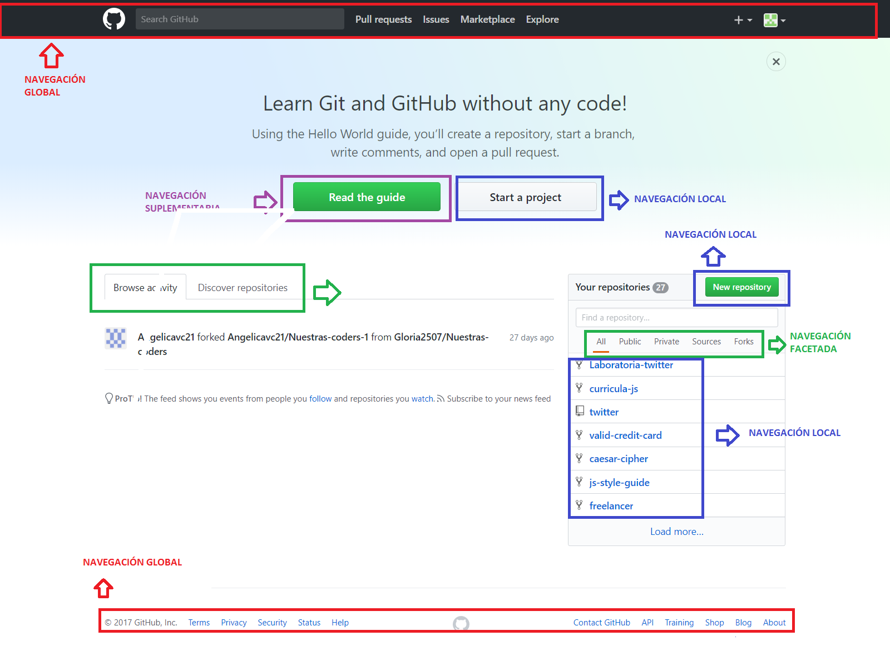
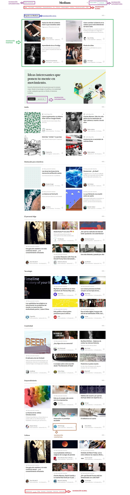

# Tipos de Navegación

*Objetivo*.- Aquí se muestra tres páginas:

-  BREATHER
* GITHUB
* MEDIUM

Hemos utilizado éstas páginas para identificar los diferentes tipos de navegación.

BREATHER

GITHUB

MEDIUM

